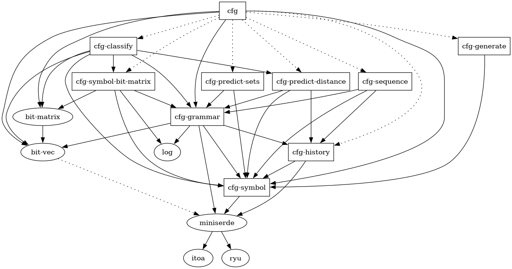

# gearley docs

## These are the docs for the Marpa/Earley parser/recognizer gearley.

We begin our journey by discussing grammar preprocessing. For that, we prepare notation, which will be used in our explanations.

## cfg project

This project includes algorithms and data structures necessary for work on context-free grammars. Splitting off this library from gearley is made in hope the work may be of use in other parsers. Few utilities are strictly
 Earley-specific; the main one is History. In case you require a different implementation of rule semantics, we encourage you to fork the library and make necessary changes.

Few of the main types are generic. The use of Cargo features is limited. Borrowing is mostly temporary. We prefer value semantics over borrowing and parameterization in order to keep it all simple.

## libs



Crates are split to improve project structure and enable parallel compilation. For example, `cfg-symbol-matrix` and `cfg-sequence` will likely be built on different CPU cores, keeping the build time smaller.

### Overview of the crates

Some crates in our project introduce a key element and a couple supporting interfaces, whereas other downstream crates provide additional procedures through extension traits. An extension trait is a pattern in Rust where behavior is added to previously defined data. This behavior can be imported in downstream code by importing the trait. All this fits into Rust's tendency to strongly separate behavior from data.

* `cfg-symbol`: introductes the `Symbol` type and key utilities for naming, generating and reordering symbols.
* `cfg-grammar`: introductes the `Cfg` type and methods for working with start symbols, symbol sets and grammar rules. Furthermore, this is the place grammar transformations happen.
* `cfg-sequence`: introduces the `CfgSequenceExt` extension trait which lets you add sequence rules the grammar.
* `cfg-history`: introduces the `History` type which is an Earley-centric struct carried with each rule with the intent to keep track of rule semantics throughout all grammar transformations.
* `cfg-symbol-bit-matrix`: introduces the `SymbolBitMatrix` type which is a bit matrix of size `N x N` where N = num_syms with the purpose of calculating and storing a property as a relation between two symbols such as the prediction (reflexive and transitive, non-symmetric) relation, or the reordering relation telling us which new symbol's ids should be smaller than other symbol's ids.
* `cfg-generate`: not for Earley's. In the future, we may build a fuzzer to test any parser against a reference parser with strings of symbols generated here. Uses `Weight: f64` from `History` for weighted generation.
* `cfg-load`: introduces two extension traits for loading a `Cfg` from a BNF-like format. One trait is for scanless grammars, another for "plain" grammars.
* `cfg-predict-sets`: introduces the `CfgSetsExt` extension trait for computing sets of symbols, which are useful for extending Earley's with lookahead, such as the "FIRST" set.

### cfg-symbol

* `Symbol` - a grammar symbol. Does not keep track of its own name or grammar it belongs to; making it a very simple wrapper around an integer.
* `SymbolName` - a cloneable name for a symbol. Implemented as `Rc<str>`
* `SymbolSource` - a symbol factory. This is meant to be the only way to create a `Symbol` with our interface, thus making it necessary to have one per grammar.
* `Mapping` - let's say you remove some unused symbols, and ask some symbols to have smaller index than other symbols, then you need a map to translate between your old symbols and new symbols as well as the other way around. We exploit the fact that symbols are wrappers around integers, so that they may participate in sorting, they themselves can be sorted according to some property, or their integer can be compared against another.

Our `Symbol`s are 0-based in the interface, yet 1-based numbered internally, so that they may only really wrap around a non-zero integer. The motivation is the fact that the size of `Symbol` == the size of `Option<Symbol>`, just like the size of `std::num::NonZeroU32` == the size of `Option<NonZeroU32>`.

#### Symbol

We allow conversion from a `Symbol` to its `usize` id with `your_symbol.usize()`.

#### SymbolSource

We do not provide an easy way to go from an ID to symbol, as you are meant to grab them only from SymbolSource or from your grammar. However, this conversion can be done with `SymbolSource::generate_fresh().nth(id).unwrap()`.

### cfg-grammar

The `Cfg` type is meant to be a swiss army knife for all Context-Free Grammars.

We have a few other types defined in this crate:

* `SymbolBitSet` - a set of symbols.
* `CfgRule` - a plain context-free grammar rule.
* `NamedCfgRule` - same as above, but with access to the symbol source's list of symbol names, giving it the ability to display those names.
* `WrappedRoot` - in case you need to delimit your entire parse with a Start of Input token and/or an End of Input token.

We have three interfaces for building distinct kinds of rules:

* "plain" rules
* precedenced rules
* sequence rules

All of those accept an array `rhs: AsRef<[Symbol]>` and optional `History` struct, though each resulting with very different semantics. All those essentially get rewritten to one or more "plain" rules or binarized rules in the grammar.

Precedenced rules are typically for adding operators with precedence to your grammar.

Sequences allow any repetition that regular expressions also allow. For example, `\d{1,10}` or `\w+` or `\w*` and even any kind of separation can all be built here in just a single rule:

For `\d{1,10}` you do

```rust
let [your_lhs, unicode_digit] = cfg.syms();
cfg.sequence(your_lhs).range(1..=10).rhs(unicode_digit);
```

Or:

```rust
cfg.sequence(your_lhs).inclusive(1, Some(10)).rhs(unicode_digit);
```

For the following BNF for a simple list of identifiers called "ident"s

```
your_lhs ::= your_lhs ~ comma ~ ident | ident;
```

You'd do

```rust
cfg.sequence(your_lhs).separator().rhs(ident);
```

Our `Cfg`s are meant to be cloned with modest cost at O(n) time.


#### notes

```
For example, the "FIRST" set is used in LL(1) parsing and contains all terminal symbols that may be scanned because the given symbol appears at that location and derives them. If the  symbol does not ..............
```

## Credit

* Mr Jeffrey Kegler's Marpa paper, documentation, and Kollos documentation provided us:
    * most ideas for parser interfaces
    * precedenced rule interface
    * sequence rule rewrite algorithm
    * nulling symbol elimination
    * rhs closure algorithm
    * idea of the use of bit matrices
    * idea of the use of Floyd-Warshall transitive closure
* Elizabeth Scott provided us:
    * explanation of the parse forest and mention of algorithms for parse forest construction
* Niko Matsakis from the Rust Core Team, author of LALRPOP, provided us:
    * LL(1)/LR(1) sets computation method called "FIRST", "LAST" and "FOLLOW" sets for lookahead

